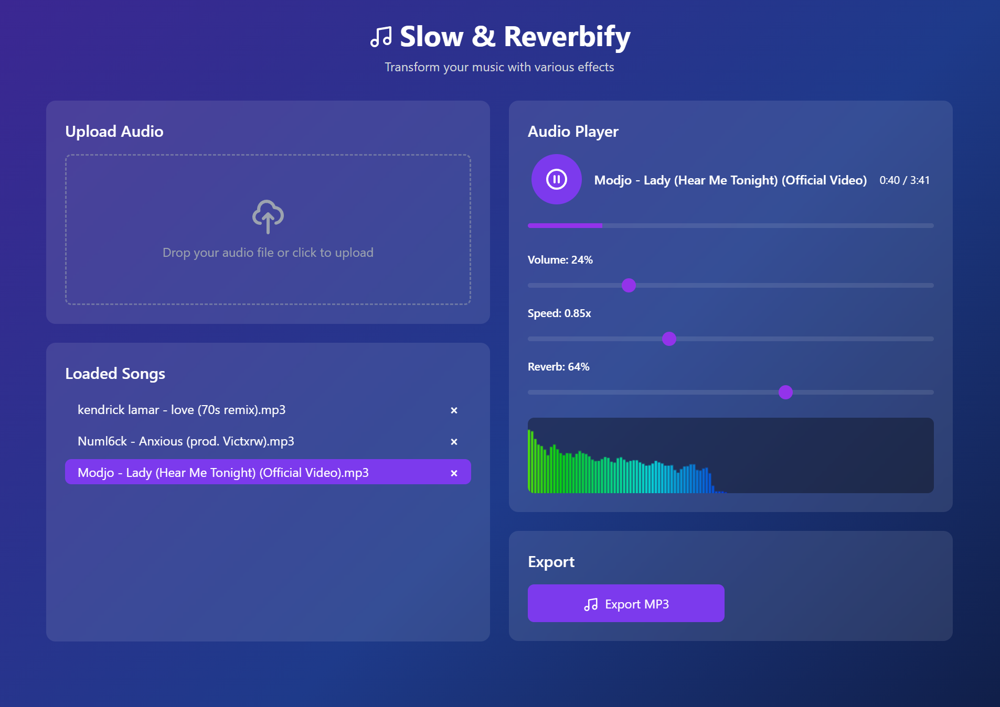

# Slow & Reverbify

Slow & Reverbify is an interactive web application that allows you to apply various audio effects to your music. Try here: https://slowandreverbify.com
 

    

    Interested in more features? Try my desktop app 
    <a 
        href="https://github.com/JahsiasWhite/AudioShape" 
        target="_blank" 
        rel="noopener noreferrer"
    >
        AudioShape
    </a>
    - a music player with real-time audio editing

## Installation

Clone this repository to your local machine:

    git clone https://github.com/JahsiasWhite/SlowAndReverbify.git

Open the index.html file in your browser to start using the application.
